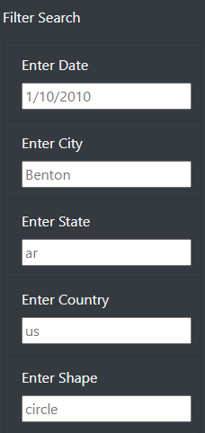

# UFOs

## Resources
- Javascript
- Visual Studio
- HTML
- CSS

## Overview
For this assessment, I was instructed to build a website by using HTML, CSS and Javascript through Visual Studio. This included creating a header, a body to hold the text and a way to filter the information we input.
To create more fields for input, I added them in as “lists”. Within the listed item, I placed a “class”, the class will be recognized by the CSS and be styled the way it is stated in the “style sheet”. After starting the class, a label is created and then a field to input information. This information is pulled from the data.js file and then brought into the webpage.

## Results
To use the new webpage that we have, we will navigate to the bottom left of our screen. From there we will input the date, city, state, country and shape! After doing so, results will show on the bottom right side that matches the criteria.

## Summary
This new design for our website allows for an even in depth filter but one thing I noticed is, we took out the button for the filtered search. I feel as though the option to click filter search was necessary for users. To allow the website to feel more at home, the use of the button would be great, I also would like to see the fields of input to be created where they came from a drop down menu. Before inputting information into the filters, there is a lot of blank space at the bottom right hand corner of our page.
